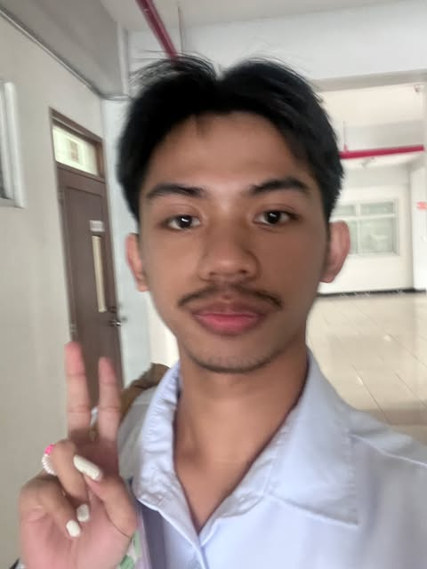

# Hey, I'm Jean Claude (szon-clawed)!  

---

## 👤 About Me  

Hi! I'm Jean Claude Macalino, a student who procrastinates. I enjoy scrolling through socials like Twitter (will never call it X) & Facebook.  
I live my life on a day-to-day basis without knowing what's next.

---

## 🔮 Areas of Interest  
- Music is my go-to ✨  
- Whole day talks with my partner 🌙  
- Enjoying films and doing marathons (ie. The Batman trilogy, Before trilogy) 🍿  

---

## 💻 Languages I Speak (Coding)  
- C++  
- Python (just the basics, still learning 🐍)  

---

## 🔧 My Projects 
- [🔗 Project 1](projects/Lab_Task1.pdf) – Midterm Lab Task 1: Getting started with Python
- [🔗 Project 2](projects/Lab_Task2.pdf) – Midterm Lab Task 2: Loop Construct
- [🔗 Project 3](projects/Lab_Task3.pdf) – Midterm Lab Task 3: Using List Collections
- [🔗 Project 4](projects/Lab_Task4.pdf) – Midterm Lab Task 4: Using Dictionary Collections
- [🔗 Project 5](projects/Lab_Task5.pdf) – Midterm Lab Task 5: Creating and Instantiating Classes
- [🔗 Project 6](projects/Lab_Task6.pdf) – Midterm Lab Task 6: Overloaded Constructors
- ad

---

## 🎉 Fun Facts About Me  
- I sleep better on my tummy  
- I've been a huge Batman fan since September 1, 2025  
- Dark mode helps with my eyes  

---

## 📬 Connect With Me  

  
  
  

---

✨ Thanks for stopping by! Keep sleighing 💜
